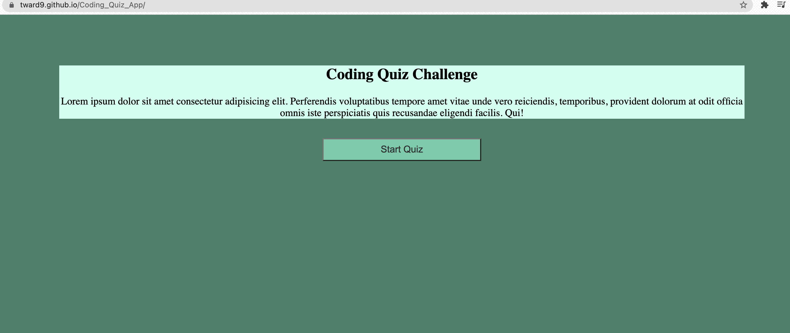

# Coding_Quiz_App
Browser Based multiple choice quiz on Coding

## Description

The goal with this project was to create a quiz on Javascript entities and arun it on a page powered by javascript. The questions are updated as the user clicks through, total score is kept based on right and wrong answers, and scores are saved locally until cleared by the user. The application can be run repeatedly by hitting the restart button at the end of the quiz.

## Usage

See the deployed application [here](https://tward9.github.io/Coding_Quiz_App/)

When opened, you should see the below image:

## Credits

Quiz questions were sorced from http://mcqspdfs.blogspot.com/2013/08/60-top-javascript-multiple-choice.html